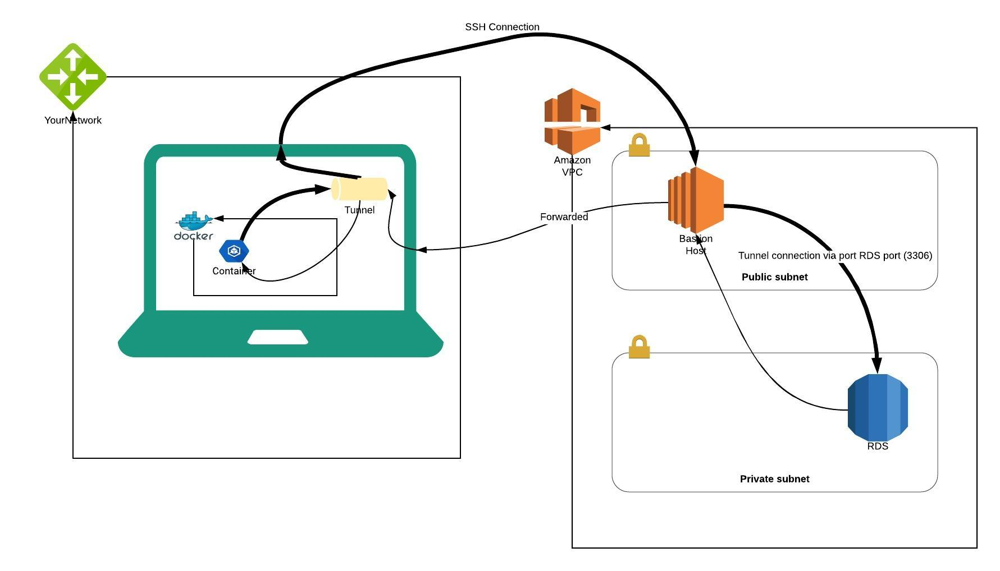

#How to create ssh tunnel to an RDS in a private subnet using a bastion host 

This terraform example shows how to setup an SSH tunnel to access an RDS service running in a private subnet. 

## Getting Started
### Requirements
* AWS account 
* CLI access to your AWS account
* Terraform 11 or higher
* Docker 

### Steps to create the setup above
* Clone this repository 
```
$ git clone https://github.com/abiredavid/ssh-tunnel-rds.git
```
* Update the variable.tf file to have an `AMI` that is available in your region. You may also want to update the `region` variable as well

* Initialize terraform
```
$ cd ssh-tunnel-rds
$ terraform init
```
* Run terraform and accept the changes
```
$ terraform apply
```
* Setup the tunnel using the command generated from the output `tunnel_setup_command` . Run the command in a terminal. You can run this in background by appending `&`
* To connect to the RDS from a docker container. You can build an sql client container as follows
```
$ cd sql-clients
$ docker build -t sql-client .
$ docker run -it sql-client bash
```
* Access the database from the container by the running the command by the terraform output `mysql_connection_command`


#
#

## Providers

| Name | Version |
|------|---------|
| aws | ~> 2.55 |
| http | n/a |
| local | n/a |
| null | n/a |
| random | ~> 2.2 |
| tls | n/a |

## Inputs

| Name | Description | Type | Default | Required |
|------|-------------|------|---------|:-----:|
| bastion\_ssh\_key\_name | SSH key to add to the bastion host | `string` | `"bastion"` | no |
| db\_instance\_type | Type of the instance used for the database | `string` | `"db.t3.micro"` | no |
| db\_name | Name of the database created | `string` | `"testdb"` | no |
| db\_pass | password for the database | `string` | `""` | no |
| db\_user | username for the database | `string` | `"root"` | no |
| default\_character\_set | Default Character Set encoding | `string` | `"utf8"` | no |
| default\_collation | Default Collation Set encoding | `string` | `"utf8_unicode_ci"` | no |
| default\_storage | Amount of storage to be allocated for the DB instance in GB | `string` | `"5"` | no |
| ec2\_ami | AMI to use for bastion host | `string` | `"ami-0323c3dd2da7fb37d"` | no |
| environment | Variable for storing environment. | `string` | `"dev"` | no |
| region | AWS region | `string` | `"us-east-1"` | no |
| vpccidr | CIDR for VPC | `string` | `"10.80.0.0/16"` | no |

## Outputs

| Name | Description |
|------|-------------|
| aurora\_endpoint | The aurora database endpoint |
| bastion\_public\_dns | Bastion host public dns |
| mysql\_connection\_command | Command you can run to access the MySQL db directly |
| password | Database password |
| tunnel\_setup\_command | Command you need to run to run to set up the tunnel |
| username | Database username |